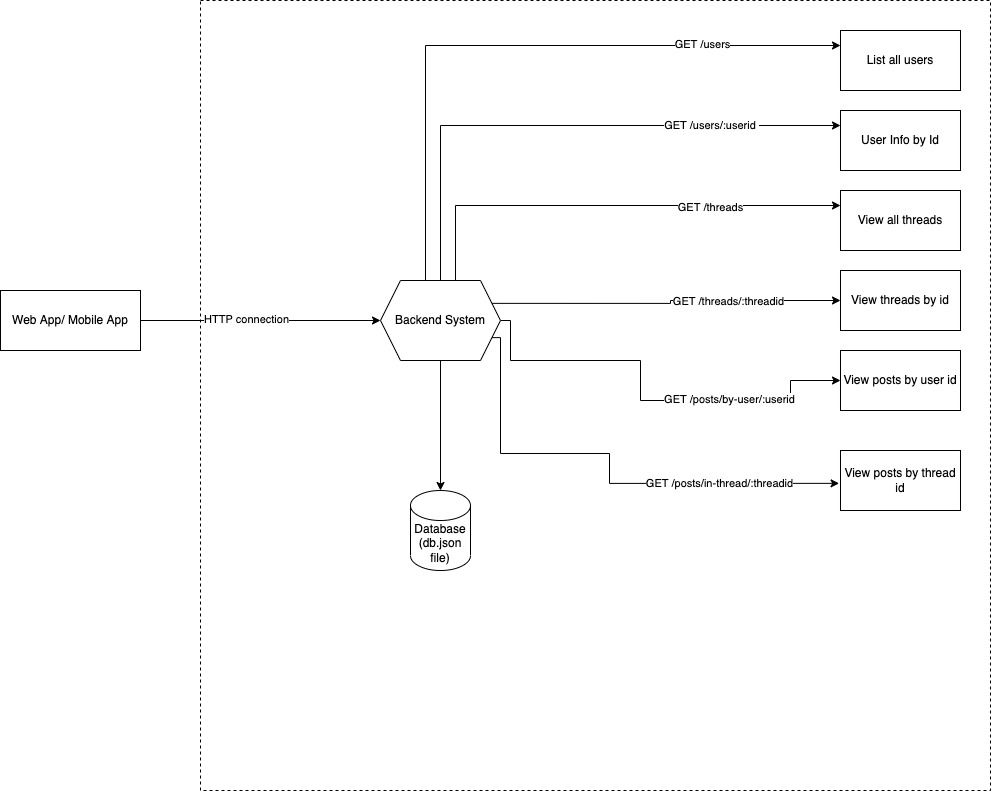

# demo-microservices-monolith

This app demonstrates how a nodejs monolith can be converted to microservices.

# Monolith App

## Monolith Architecture





## Running the monolith locally

Step 1: Clone this repository
Step 2: Navigate to the monolith folder
Steo 3: Run the following commands to start the application

``` 
    npm install
    npm start
```

Step 4: To test, run the following commands:
```
$ curl localhost:3000/api/users
$ curl localhost:3000/api/users/1
$ curl localhost:3000/api/threads
$ curl localhost:3000/api/threads/1
$ curl localhost:3000/api/posts/by-user/1
```

## Run the monolith on docker

Steo 1: Install and start docker
Steo 2: Build the docker image
```
   docker build . -t demo-app:1.0
```
Step 3: Run the docker image
```
   docker run -p 3000:3000 demo-app:1.0
```
Step 4: Test using the following commands:
```
$ curl localhost:3000/api/users
$ curl localhost:3000/api/users/1
$ curl localhost:3000/api/threads
$ curl localhost:3000/api/threads/1
$ curl localhost:3000/api/posts/by-user/1
```


## Run the monolith on RedHat OpenShift

Step 1: In this demo app, the [code ready containers](https://console.redhat.com/openshift/create/local) provided by OpenShift have been used. Install code ready containers for your desktop in case you dont have access to the OpenShift Container Platform.

Step 2: Login as the kubernetes admin. This role is temporary in crc. Therefore it is necessary to provide admin privileges to the developer.

```
oc login -u kubeadmin https://api.crc.testing:6443
oc adm policy add-role-to-user admin developer
```

Step 3: Login as developer and create the following namespaces

```
oc login -u developer https://api.crc.testing:6443
oc new-project demo-tools
oc new-project demo-dev
```

Step 4: 


# Microservices App

## Microservices Architecture


## Running the microservices locally

Step 1: Clone this repository
Step 2: Navigate to the microservices folder
Steo 3: Run the following commands to start each microservice

``` 
    cd posts
    npm install
    PORT=3001 npm start
```

``` 
    cd threads
    npm install
    PORT=3002 npm start
```

``` 
    cd users
    npm install
    PORT=3003 npm start
```

Step 4: To test, run the following commands:
```
$ curl localhost:3003/api/users
$ curl localhost:3003/api/users/1
$ curl localhost:3002/api/threads
$ curl localhost:3002/api/threads/1
$ curl localhost:3001/api/posts/by-user/1
```

## Running the microservices on docker

Step 1: Clone this repository
Step 2: Navigate to the microservices folder
Steo 3: Run the following commands to start each microservice

``` 
    cd posts
    docker build . -t post:1.0
    docker run -p 
```

``` 
    cd threads
    npm install
    PORT=3002 npm start
```

``` 
    cd users
    npm install
    PORT=3003 npm start
```

Step 4: To test, run the following commands:
```
$ curl localhost:3003/api/users
$ curl localhost:3003/api/users/1
$ curl localhost:3002/api/threads
$ curl localhost:3002/api/threads/1
$ curl localhost:3001/api/posts/by-user/1
```

